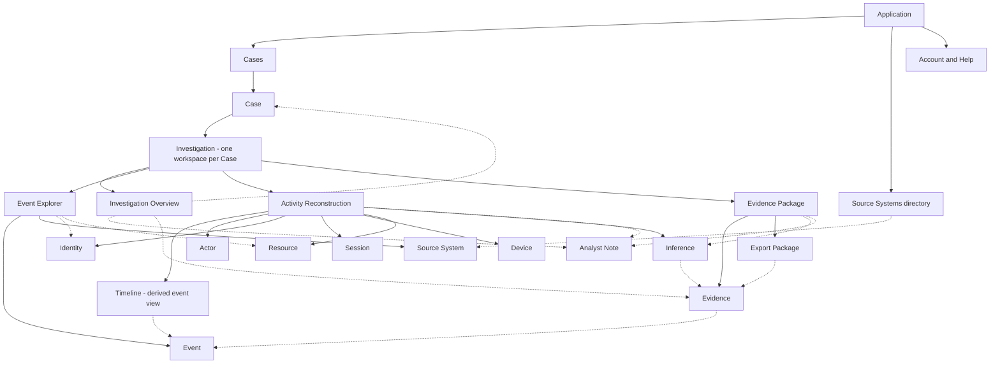

# PHASE 03 — INFORMATION ARCHITECTURE

Status: Proposed for human review; not approved.

## Basis and decision status

**FACT — Sources:** This document uses [BRIEF.md](BRIEF.md), [UX_ASSUMPTIONS.md](UX_ASSUMPTIONS.md), and [AGENTS.md](../AGENTS.md). Brief references use its section and FR identifiers; assumption identifiers refer to Phase 02. Challenge facts are fictional project inputs, not validated research.

**FACT — Authorization:** The current instruction authorizes Phase 03 and supersedes the earlier Phase 03 hold. It authorizes a documentation proposal, including a Mermaid diagram. It does not approve this IA or resolve Phase 02 assumptions. No Figma modifications, visual UI, high-fidelity designs, or styling decisions are part of this phase.

Labels throughout:

- **FACT:** An attributed requirement or supplied input.
- **ASSUMPTION:** An unvalidated condition on which the proposal depends.
- **DESIGN DECISION — Proposed:** A recommendation for the human designer to accept, change, or reject. All entity fields, cardinalities, actions, navigation, trees, and diagrams below have this status unless explicitly labeled otherwise.
- **OPEN QUESTION:** A decision or capability still requiring clarification.

## Core domain model — define the record before the navigation

### Case and Investigation

**DESIGN DECISION — Proposed:** A **Case** is the durable investigation record: its identity, purpose, declared scope, preservation settings, evidence, reasoning, access record, and export history. An **Investigation** is the analytical workspace through which that case is examined and developed.

For this scope, each Case has exactly one Investigation workspace, and each Investigation belongs to exactly one Case. Opening a case opens its investigation. There is no second creation step, independent investigation directory, or nested investigation hierarchy. This is a conceptual distinction between governance and analytical work, not a requirement for separate database objects.

**ASSUMPTION — P-01/P-02:** One workspace per case is sufficient for the supplied scenario. Multiple investigations per case, merged cases, and cross-case evidence sharing are not established requirements.

**OPEN QUESTION — Human designer / Product:** Accept this one-to-one model and the application entry label “Cases,” or use a single user-facing term throughout? If parallel investigative tracks are required, revisit ownership and persistence before adding nested containers.

### Source observation, attribution, and interpretation

**DESIGN DECISION — Proposed:** An Event records what a Source System reported. It may reference source-scoped Identities, Sessions, Devices, and Resources. An Actor is a subject of attribution; an Identity is an account or principal identifier reported by a source. A shared display name does not establish a shared Actor.

Event participation carries a role, such as initiator or affected identity. The role recipient must remain distinguishable from the identity that assigned the role. An administrator role is event/resource context, not a separate person. “User” is a source or domain-specific identity type, not a synonym for every Actor.

Source-reported relationships retain their supporting record and source vocabulary. Analyst-proposed relationships are represented as Inferences. Neither temporal proximity nor analyst acceptance converts a proposed relationship into a source observation. A source-reported identity also does not prove which human physically acted.

### Relationship contract

**DESIGN DECISION — Proposed:** Cardinalities below describe the conceptual model. Missing or disputed links are allowed; these are not claims about available integrations.

| Relationship | Proposed cardinality and meaning | Qualification |
| --- | --- | --- |
| Case → Investigation | Exactly one workspace per Case; exactly one owning Case per workspace. | One-to-one scope proposal, not a platform fact. |
| Case → Evidence / Inference / Analyst Note / Export Package | One Case owns zero or more of each. Investigation provides access to these same records. | No duplicate area-specific copies; no cross-case sharing implied. |
| Investigation → Event | Many-to-many references: zero or more events may be explored in a workspace; an event may be encountered in different cases. | Search visibility does not mean preservation or permission to see another case. |
| Source System → Event | One source provenance context per Event; a source may report many events. | Preserve upstream origin and ingestion provenance separately if aggregation occurs. |
| Source System → Identity / Session / Device / Resource | Source-scoped identifiers qualify each record; a source can expose many of each. | Equal identifier strings across sources are not sufficient for equality. |
| Actor ↔ Identity | An Actor may have zero or more supported identity associations. An Identity may have zero or more candidate or time-qualified Actor associations. | Ambiguous/shared/reassigned accounts remain explicit; no single-person attribution is forced. |
| Event ↔ Identity | An Event may reference zero or more Identities, each with a participation role; an Identity can appear in many events. | Initiator, affected identity, and unknown role stay distinct. |
| Event ↔ Session | An Event may have zero or more supported session references; a Session may group many events. | Cross-source session equivalence requires evidence, not a universal session ID. |
| Session ↔ Identity / Device | A Session may have zero or more documented links to identities or devices; each may occur in many sessions. | Do not infer exclusive ownership or one device per session. |
| Event ↔ Device / Resource | An Event may reference zero or more devices and resources; each can appear in many events. | Preserve relationship type; missing device identifiers do not create one shared “unknown device.” |
| Evidence → Event | Each Evidence item preserves one selected source Event and its provenance; an Event can support case-specific preservation records. | Granularity is proposed; compound attachments remain out of scope pending need. |
| Inference ↔ Evidence / Event | An Inference can cite multiple supporting or contradicting items; each item can be cited by multiple Inferences. | Draft claims can lack support but must say so. Live event citations are not preserved evidence. |
| Analyst Note → Case and contextual targets | Each Note belongs to one Case and may reference events, evidence, entities, or inferences. | Contextual links do not turn the note into observed evidence. |
| Export Package → Case records | Each package belongs to one Case and identifies exact included evidence and reasoning revisions. Records may appear in multiple packages. | A generated package is a fixed output, not the changing case. |

**DESIGN DECISION — Proposed:** A relationship needs its type, endpoints, basis, supporting record reference, source or author, relevant time interval when known, and unresolved/conflicting status. These are conceptual relationship attributes rather than an additional primary navigation entity. No arbitrary confidence score or automatic identity merge is introduced.

### Persistence boundaries

**DESIGN DECISION — Proposed:** Keep five distinct kinds of state:

1. **Declared case scope:** The investigative question, intended time range, relevant subjects/resources, authorized source boundary, and preservation intent. Temporary filters do not rewrite it.
2. **Working investigation context:** Query criteria, area, selected entity, reconstruction focus, and navigation return point. Saving criteria does not freeze result membership.
3. **Preserved evidence:** Original selected event content and provenance, with an explicit preservation outcome. A pending request or unavailable reference must not be described as preserved.
4. **Analyst content:** Attributable notes and inferences, with revision references so earlier exported reasoning can be understood.
5. **Exported state:** A fixed package manifest and included versions, generation information, and integrity record. Subsequent arrivals or edits do not silently update an earlier package.

**ASSUMPTION — P-02/P-05/P-06/P-07, S-01/S-05:** These persistence and revision capabilities are feasible. The preservation boundary is a proposed product contract, not confirmation that retained copies survive expiry. Storage, retention, note history, and deletion policies remain unresolved.

## 1. Global navigation

**DESIGN DECISION — Proposed:** Application-level navigation contains destinations that do not depend on an active case.

| Destination | Responsibility | Boundary |
| --- | --- | --- |
| Cases | Find and reopen authorized cases; create a case with scope and preservation settings. | Primary application entry. No second global Investigations list. Case listing is proposed, while case creation is required by FR-01. |
| Source Systems | Read authorized source availability, source vocabulary, timing quality, and documented coverage limitations. | Context directory only. Connection administration and source provisioning require separately approved scope. |
| Account and Help | Current signed-in context, permitted preferences such as display timezone, and terminology/help. | Supporting utility proposal, not an enterprise administration suite. |

**DESIGN DECISION — Proposed:** Events, actors, sessions, devices, evidence, and packages are reached within a case. A global entity directory, global search, reporting dashboard, and global exports destination have no established need in this brief. Source metadata reached from an investigation preserves a return to that investigation.

**OPEN QUESTION — Product / Security:** Does source visibility belong in a standalone directory or only in contextual source details? Does the application need organization/workspace switching? Neither is specified; no multi-tenant hierarchy is assumed.

## 2. Investigation navigation

**FACT — Brief FR-15:** The four required areas are Investigation Overview, Event Explorer, Activity Reconstruction, and Evidence Package.

**DESIGN DECISION — Proposed:** These are peer destinations within the same active Investigation. They are not mandatory sequential stages or completion gates. An analyst can move among them repeatedly, and Evidence Package can be used during evidence gathering.

| Area | Primary question | Canonical responsibility |
| --- | --- | --- |
| Investigation Overview | What are we investigating, under what scope and limitations? | Case context, scope, preservation settings, and case activity record. |
| Event Explorer | Which authorized source records are relevant? | Query state, result qualifications, and source-event inspection. |
| Activity Reconstruction | What relationships and sequence do these records support? | Timeline, entity relationships, and inference development. |
| Evidence Package | What have we retained, and what will a recipient receive? | Preserved evidence inventory, package composition, generated packages, and integrity records. |

**DESIGN DECISION — Proposed:** Actor, Identity, Session, Device, Resource, Event, Evidence, Inference, and Note details are shared contextual destinations. They are not extra peer areas. Entity links refer to the same underlying record from every area; summaries link to their canonical responsibility instead of duplicating editable settings.

## 3. Information hierarchy

**DESIGN DECISION — Proposed:** “Persistent” below describes information availability and retained context, not screen placement or visual treatment.

| Level | Information that must remain available | Persistence rule |
| --- | --- | --- |
| Application context | Current authorized identity and application/source access boundary. | Recheck access on each destination; context cannot confer permission. |
| Investigation context | Case identifier/title, investigative question, declared scope, current area, preservation outcome, and known case-level limitations. | Retained across area changes and resumption; distinguish intended preservation settings from completed preservation. |
| Working context | Effective query, selected subject and participation role, time range, source scope, display timezone, and whether material is live or preserved. | Retain per-area working state; describe any scope changes introduced by a pivot. |
| Result/sequence qualifications | Query execution status and limits, known coverage gaps, unknown coverage, source timing quality, and last retrieval time when available. | Travel with the affected results or reconstruction; never imply completeness from a result count. |
| Selected record | Stable reference, original source content, source ID, original timestamp, ingestion time, clock quality, and relationship basis. | Available with event inspection across areas. Converted times supplement originals. |
| Reasoning and delivery | Evidence status, inference versus note classification, author/revision, package inclusion and generated version. | Retain links back to observations and limitations, including from a package snapshot. |

**DESIGN DECISION — Proposed:** No matches, incomplete search, known retention gap, unknown coverage, missing field, and access restriction are different information states. Do not relabel one as another. Access explanations must not reveal unauthorized record details.

## 4. Core entities

**DESIGN DECISION — Proposed:** The following attributes are conceptual information needs, not a required form, database schema, or claim that every source supplies every field. Unknown values remain unknown. All actions are conditional on applicable authorization; raw source content cannot be edited.

### Case

- **Purpose:** Durable record of the investigative question and its handling.
- **Important attributes:** Case ID, title/question, creator, created time, declared scope and its revision, preservation intent/settings and outcomes, known limitations; ownership and lifecycle vocabulary pending policy.
- **Relationships:** One Investigation; owns Evidence, Inferences, Notes, Export Packages, and the case audit record.
- **Actions:** Create, open/resume, inspect context, propose/revise scope or preservation settings under policy, inspect handling history. Closing, deleting, transferring, and legal holds remain undecided.

### Investigation

- **Purpose:** Analytical workspace for developing the Case.
- **Important attributes:** Owning Case reference, active area, query definitions, selected entity, reconstruction scope, working-state save status.
- **Relationships:** One Case; references Events and their entities; uses the Case’s evidence and reasoning.
- **Actions:** Navigate areas, narrow/widen working scope, inspect relationships, resume context. No independent creation or separate lifecycle in this proposal.

### Actor

- **Purpose:** Subject to which activity may be attributed without collapsing source identities.
- **Important attributes:** Investigation-facing reference, display description, subject type if known, identity associations, provenance, attribution limitations.
- **Relationships:** Identity associations with evidence basis; Events, Sessions, Devices, and Resources through qualified links.
- **Actions:** Inspect attribution basis, filter related activity, examine contradictions, record an inference about attribution. No unsupported merge or assertion of physical authorship.

### Identity

- **Purpose:** Source-scoped account/principal representation appearing in logs.
- **Important attributes:** Source/namespace, original identifier, reported name/type, validity interval if available, mapping basis and uncertainty.
- **Relationships:** Source System; Events with participation roles; Sessions; supported or candidate Actor associations.
- **Actions:** Inspect original identifiers, search exact identity and role, review mappings, compare candidate associations without merging observations.

### Session

- **Purpose:** Documented context grouping related activity.
- **Important attributes:** Source-qualified session reference, reported start/end when available, participating identities, timing quality, relationship provenance.
- **Relationships:** Events, Identities, Devices; cross-source sessions only through supported or explicitly inferred links.
- **Actions:** Expand associated events, inspect linkage basis, focus reconstruction, preserve selected source events. A session reference does not preserve every event automatically.

### Device

- **Purpose:** Source-reported endpoint context relevant to activity.
- **Important attributes:** Source-qualified identifier when available, reported attributes, observation times, provenance and unresolved identity state.
- **Relationships:** Events and Sessions; Actor/Identity association only through documented activity or a labeled inference.
- **Actions:** Inspect reported details, pivot to supported related activity, document missing attribution. Missing identifiers stay attached to affected observations rather than becoming a fabricated device entity.

### Event

- **Purpose:** Immutable source observation, including sign-in, role assignment, customer export start, or revocation.
- **Important attributes:** Stable provenance reference, original source identifier/content, action, participating identities and roles, resource references, original timestamp and timezone if supplied, ingestion time, clock quality; normalized fields separately identified.
- **Relationships:** Source System; zero or more supported Identity/Session/Device/Resource links; Evidence representations and reasoning citations.
- **Actions:** Inspect original and normalized information, filter/pivot, locate in reconstruction, request preservation, attach Note or cite in an Inference. No editing original logs or inferred export completion.

### Source System

- **Purpose:** Provenance and access/coverage context for records.
- **Important attributes:** Source reference/name, identifier namespace, schema context, authorized availability, timing-quality basis, documented retention coverage and freshness when available.
- **Relationships:** Events and source-scoped entity identifiers; referenced by case scope and Evidence provenance.
- **Actions:** Inspect authorized metadata, constrain query, trace event provenance, return to case context. No source administration implied.

### Resource

- **Purpose:** Target or affected object of an action.
- **Important attributes:** Source-qualified identifier, source type/name, role in event, relevant reported attributes and provenance.
- **Relationships:** Source System and Events; related Identities/Actors only through qualified event roles.
- **Actions:** Filter activity, inspect referenced events, focus reconstruction, cite relevant observations. Resource types remain source-dependent.

### Evidence

- **Purpose:** Case-owned preservation record for selected original event content and provenance.
- **Important attributes:** Evidence ID, owning Case, originating Event/source references, preserved content reference, added-by/time, preservation outcome, content availability, limitations and integrity metadata where supported.
- **Relationships:** One original Event per item in this proposal; Inferences/Notes; zero or more Export Packages.
- **Actions:** Preserve, inspect retained content and origin, cite, select for package, inspect addition record. Excluding from a draft package does not delete the Case’s evidence. Retention/deletion rules remain open.

### Inference

- **Purpose:** Explicit analyst interpretation distinguishable from source observation.
- **Important attributes:** Claim text, author/time, revision reference, supporting and contradicting citations, limitations, review/revision state as proposed vocabulary.
- **Relationships:** Owning Case; Evidence and/or live Event citations; implicated entities; Notes; exact revisions included in packages.
- **Actions:** Mark/create, link support and counterevidence, revise or withdraw with attributable history, inspect cited observations. Unsupported claims remain visibly unsupported; no automated inference is assumed.

### Analyst Note

- **Purpose:** Attributable working context or commentary.
- **Important attributes:** Text, author/time, owning Case, contextual references, revision information subject to approved history policy.
- **Relationships:** Case and optional Event, Evidence, entity, or Inference targets; selected revisions may be included in a package.
- **Actions:** Add, inspect, revise with attribution, link context, select for export. A claim requiring evidentiary support should be separately recorded as an Inference with its note provenance retained.

### Export Package

- **Purpose:** Fixed, verifiable output of a particular Case state; distinct from the customer export event being investigated.
- **Important attributes:** Package ID, Case reference, generation time/author, manifest of included Evidence and reasoning revisions, scope/limitations snapshot, hash and verification scope/status, export integrity record.
- **Relationships:** One Case; exact included record versions; related case audit entry. Multiple packages may reflect successive states.
- **Actions:** Compose selection, inspect omissions/dependencies, generate a distinct version, inspect manifest/integrity, download and verify through an agreed method. Generation/download does not imply recipient delivery or receipt.

### Supporting concepts

**DESIGN DECISION — Proposed:** Query/Saved Query belongs to Event Explorer and stores criteria with explicit matching/time semantics; it is not Evidence. Timeline belongs to Activity Reconstruction and is a derived view of scoped Events and qualified relationships; it is not a new source of truth. Coverage limitations belong to relevant sources, time ranges, and records and are summarized in Overview and package context. The Case Audit Record exposes the required access, evidence-addition, and export-integrity records through Overview, with contextual links elsewhere. Exact audit fields and reader permissions remain open.

## 5. Product areas — responsibilities and boundaries

**DESIGN DECISION — Proposed:** Each area owns a different investigative responsibility while referencing shared records.

| Area | Contains and is responsible for | Boundary and handoffs |
| --- | --- | --- |
| Investigation Overview | Question, anchor event if available, scope, preservation settings/outcomes, documented gaps, summaries of evidence/reasoning, case activity record. | Orients and governs the Case. Detailed search belongs in Explorer; relationship assessment in Reconstruction; export composition in Evidence Package. Summaries link to the same records. |
| Event Explorer | Actor/identity-role, action, resource, time, source filters; visible effective query; saved query criteria; result execution/coverage qualifications; source Event inspection; contextual preservation and annotation actions. | Handles live discovery. Opening or saving a query does not preserve its results. Session expansion that broadens a query must disclose the scope change. It hands selected context to Reconstruction. |
| Activity Reconstruction | Timeline and ordering basis; Actor/Identity/Session/Device/Resource relationships; provenance, missing links, alternate explanations, Inferences and contextual Notes; preservation of selected source Events. | Develops a qualified account. It does not repair raw timestamps, force a total order, or invent missing identifiers. Discovery links return to Explorer; preserved support links to Evidence Package. |
| Evidence Package | Retained Evidence inventory and outcomes; linked reasoning and limitations; proposed package membership; inclusion/dependency review; package versions, manifests, verification scope and integrity records. | Separates case evidence inventory from each export selection. No export silently includes all live results or every working Note. A package cannot imply that uncaptured cited material was preserved. |

**OPEN QUESTION — Product / Recipients / Security:** Approve the minimum package contents and treatment of live citations, omitted support, contradictory evidence, sensitive content, and unresolved preservation before defining export readiness. The IA proposes exposing these conditions; it does not invent a mandatory review/approval workflow or recipient role.

## 6. Cross-navigation — preserve investigation context

**DESIGN DECISION — Proposed:** Every investigation link carries the Case/Investigation reference, target entity reference, and originating area/return state. Relevant working query, selected event, time scope, timezone, and live-versus-preserved mode are retained. Entity reference and authorization are checked again on arrival. These are navigation semantics; URL format and controls are deferred.

| Movement | Context carried and meaning |
| --- | --- |
| Event → Actor / Identity | Carry the Event and participation role; inspect the specific identity first where attribution is unresolved. Do not silently search all same-named accounts. |
| Actor / Identity → Events | Open Explorer with the intended identity set and roles explicit. State whether the pivot refines or replaces temporary criteria; keep prior query available on return. |
| Event → Session → Timeline | Follow an existing qualified session association. Reconstruction retains the anchor Event and states any widening needed to include session activity. No supported session means an unresolved relationship, not a synthetic session. |
| Event / Session → Device | Inspect supported device references. Missing device information remains inspectable as a limitation on that Event/Session; do not offer an invented device-level activity set. |
| Device → Events / Sessions | Retain source namespace and link basis; return to the originating scope after inspecting related activity. |
| Timeline → Event | Inspect the exact source observation with original time, ingestion time, and clock quality; returning restores reconstruction focus and ordering basis. |
| Event → Evidence | Request preservation and navigate to the resulting case Evidence item/outcome. Preserve the distinction between source availability and retained content availability. |
| Evidence → Event / Timeline | Open the preserved source content by default; a separate live-origin reference may be unavailable. Timeline context uses the referenced observation and discloses live/preserved membership. |
| Inference / Note → Evidence / Event | Follow the exact citation/revision with its qualification; preserve a return to the claim or note. Missing or restricted support remains explicit within disclosure limits. |
| Export Package → Evidence / Reasoning | Inspect the versions included in that package. Navigating to current Case state is a distinct contextual change. |

**DESIGN DECISION — Proposed:** Navigation does not automatically alter declared Case scope, preserve results, accept a relationship, or change package membership. Necessary query expansion is described and retained as a new working state. If a new selection conflicts with filters, explain the conflict rather than silently dropping criteria or showing an unexplained empty result.

On resumption, restore saved criteria and reasoning but distinguish a new query execution from previous results. Use available retrieval metadata without claiming a complete history or automatic late-arrival detection. A direct link without a valid return point opens the authorized target in its owning investigation with the Case and area identified. Access loss yields a permitted explanation and return path, not disclosure of protected names or counts.

## 7. IA risks and unresolved dependencies

**ASSUMPTION — Risk assessment:** Severity here describes potential architectural impact, not measured incident likelihood or a completed validation finding.

| Severity | Dependency / Phase 02 references | IA risk and bounded proposal | Needed validation / owner |
| --- | --- | --- | --- |
| Major | Case versus Investigation; P-01/P-02, U-07 | A one-to-one workspace could fail for parallel investigations. Keep one entry and no extra hierarchy until needed. | Human designer/Product approve terminology and cardinality using a multi-track case example. |
| Critical | Identity/session/correlation; D-04/D-05/D-07, B-04 | Entity pivots could imply false attribution or fail the required session path. Use provenance-qualified links and unresolved states; add no mock mappings. | Engineering demonstrate source fields; analysts assess association basis. |
| Critical | Preservation; P-05, B-05, S-01 | Evidence inventory could promise durable content when only a reference survives. Distinguish request, retained content, and unavailable outcomes. | Engineering and policy owners define retention/preservation and test source expiry. |
| Critical | Chronology/coverage; D-02/D-03/D-08 | Timeline or result counts could imply reliable ordering/completeness. Carry original timing, coverage, and unknowns. | Engineering establish available metadata; analysts review ambiguous ordering. |
| Critical | Access; S-04, U-07 | Source links, retained evidence, or exports could bypass source permissions. Require policy checks at each boundary; no reviewer role assumed. | Security define source/case/evidence/export and revocation policies. |
| Critical | Versions/verification; P-08, S-02/S-03/S-05 | A recipient may not reproduce the included state or understand what a hash establishes. Separate package snapshots and exact citations. | Product identify recipients; Engineering/Security define manifest, trust reference, audit and verification scope. |
| Major | Persistence/reasoning; B-07, P-02/P-06/P-07 | Resumption or revised claims could obscure earlier conclusions. Separate live criteria, retained observations, and analyst revisions. | Product/Engineering agree save and history semantics; analysts assess resumption. |
| Critical | Search; D-01, P-03/P-04 | Pivots could be too broad, semantically inconsistent, or incomplete. Carry matching and execution qualifications; claim no performance result. | Engineering test representative filters, missing values, caps, and boundary semantics. |
| Major | Vocabulary/area coherence; U-01/U-04/U-05, Brief A7 | Analysts may not understand entity distinctions or area boundaries. Keep canonical responsibilities and shared links; labels remain proposed. | Human review, followed by later terminology and navigation validation with analysts. |
| Minor | Application utilities; U-03, P-01 | A global source directory or utilities may add unnecessary scope. They remain supporting proposals. | Product confirm whether contextual access alone suffices. |

**OPEN QUESTION — Human designer:** Approval should explicitly address the Case/Investigation model, area boundaries, persistence contract, and which architectural assumptions may be bounded for this fictional challenge. Phase 02 approval did not independently approve these conditions.

## 8. Proposed IA tree

**DESIGN DECISION — Proposed:** Indentation shows navigation/content organization, not exclusive entity ownership or a sequence of screens. Shared contextual entities below refer to the same records wherever reached.

```text
Application
├── Cases
│   ├── Authorized case list / create case
│   └── Case → its single Investigation workspace
│       ├── Persistent investigation context
│       │   └── Case identity, question, declared scope, preservation, limitations
│       ├── Investigation Overview
│       │   ├── Case purpose and anchor event
│       │   ├── Scope and preservation settings / outcomes
│       │   ├── Evidence, reasoning, and limitations summaries
│       │   └── Case audit record
│       ├── Event Explorer
│       │   ├── Working query / saved criteria
│       │   ├── Results / execution and coverage qualifications
│       │   └── Event inspection and contextual entity links
│       ├── Activity Reconstruction
│       │   ├── Timeline / ordering qualifications
│       │   ├── Entity relationships / provenance / unresolved links
│       │   └── Inferences and contextual analyst notes
│       ├── Evidence Package
│       │   ├── Case evidence inventory / preservation outcomes
│       │   ├── Package selection / reasoning / limitations
│       │   └── Generated Export Packages
│       │       └── Exact membership, revisions, manifest, integrity record
│       └── Shared contextual destinations (not additional peer areas)
│           ├── Event / Source System
│           ├── Actor / Identity / Session / Device / Resource
│           └── Evidence / Inference / Analyst Note
├── Source Systems (authorized metadata; proposed supporting destination)
└── Account and Help (proposed utilities)
```

## 9. Mermaid diagram

**DESIGN DECISION — Proposed:** Solid arrows represent navigation/content access. Dotted arrows represent shared record references; they do not imply exclusive ownership, a database schema, proven relationships, or required investigation order. Case contains the single Investigation workspace. Core entities appear once to emphasize reuse across areas. See the domain relationship table for cardinality and provenance rules.



## 10. Design rationale

**DESIGN DECISION — Proposed rationale:** The Case gives the work a durable question, boundary, preservation intent, and handling record. Search results can change while the Case retains what the analyst preserved and concluded. This supports the brief’s requirement for a defensible account across investigation and handoff.

Separating Identity from Actor allows source differences and uncertain attribution to remain visible. Participation roles protect the distinction between assigning a role and receiving it. Session and Device paths depend on documented associations, so reconstruction can stop at a legitimate unknown instead of completing a misleading narrative.

Activity Reconstruction brings relationship provenance and chronology qualifications together. Source time, ingestion time, and clock quality explain different conditions. The required sequence can be inspected without treating chronological proximity as causation. Evidence, Inference, and Note remain different record types, letting a reviewer trace an interpretation back to observations and contrary material.

Evidence Package distinguishes retained material from the current search and from each exported selection. A fixed manifest links a generated output to its supporting record versions and known limitations. Hash verification concerns the defined integrity scope; it does not establish source truth, completeness, intent, or legal admissibility.

The four areas support returning to discovery when reconstruction reveals a gap and preserving evidence during exploration. Shared entity references and retained working context support this iteration without fragmenting the Case into unrelated object browsers. These are reasoned design benefits, not measured usability outcomes.

### Supplied scenario trace — conceptual coverage check

**FACT — Brief §5:** The supplied sequence is sign-in at 09:14, administrator assignment at 09:19, customer export started at 09:26, and revocation at 09:41. The identity clock is verified, the export arrives four minutes late, and the device identifier is unavailable. Date/timezone, session mapping, export completion, and revocation initiator are not supplied.

**DESIGN DECISION — Proposed:** Overview holds the Case question around the assignment. Explorer supports user/resource filtering with identity participation roles retained. Reconstruction can inspect the four supplied activities; expansion to a Session remains conditional on actual supporting records. Missing Device attribution stays unresolved, and late ingestion is not treated as a correction to event time. An analyst can separately mark an Inference without inventing its content. Selected source Events enter the evidence inventory with preservation outcomes, and an Export Package identifies the included state and limitations. This checks conceptual coverage only; detailed user flows belong to Phase 04.

### Requirement traceability

| Brief requirement | IA coverage |
| --- | --- |
| FR-01 | Case creation; Overview scope and preservation. |
| FR-02/03 | Explorer criteria and result qualifications; contextual identity/resource/session navigation. |
| FR-04/05 | Reconstruction relationships, timeline, and explicit unresolved links. |
| FR-06/07 | Evidence contract and preservation outcomes; immutable original Event boundary. |
| FR-08/14 | Record-level provenance, separate original/ingestion/display time and clock quality. |
| FR-09 | Distinct Evidence, Inference, and Analyst Note entities with citations. |
| FR-10/11 | Case audit access in Overview; Evidence Package versions and integrity records. |
| FR-12/13 | Authorization on every contextual path; source and result coverage qualifications. |
| FR-15/16 | Four named areas included. Four-screen visual deliverable remains deferred to later authorized phases. |

## Phase 03 read-only audit

**FACT — Audit performed:** Read back this document and reviewed it against the user's ten requested sections, all 13 named entities, Brief FR-01–FR-16, and the Phase 02 assumption boundaries. This was a documentation audit; no user testing, engineering validation, Figma inspection, or accessibility conformance assessment was performed. Recording this audit does not approve or revise the proposed IA.

- **Critical findings:** None identified in documentation coverage or factual attribution. The critical architecture dependencies in §7 remain unresolved and are not validated by this audit.
- **Major findings:** None identified. Every named entity has purpose, attributes, relationships, and actions; all four areas have defined responsibilities; cross-navigation retains investigation context; the source scenario's unknowns remain explicit.
- **Minor findings:** None identified in the text/tree consistency and manual Mermaid syntax review. The Mermaid source was not rendered, so rendered layout remains unverified.

**FACT — Phase boundary check:** Only the requested IA document was created. Existing brief and assumption documents were preserved. No Figma content, visual UI, styling, high-fidelity designs, or later-phase artifacts were created.

## Human review scope

**OPEN QUESTION — Human designer:** Review the one-to-one Case/Investigation distinction, global destinations, four area responsibilities, shared entity navigation, and separation of live context, preserved evidence, analyst revisions, and package snapshots. Confirm or revise the architecture-critical bounds in §7 before dependent design work. This proposal does not select visual direction or authorize Phase 04.

HUMAN REVIEW REQUIRED

