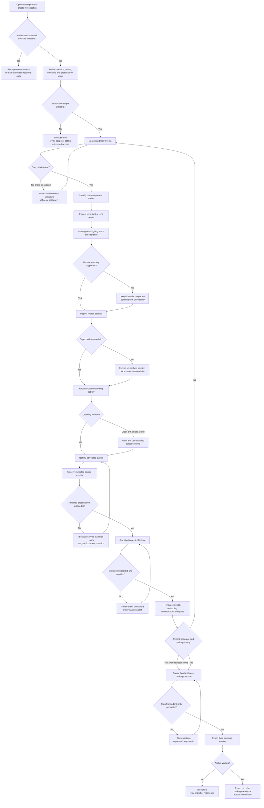

# Audit Log Investigation — Primary Investigation Flow

Phase 04 — Critical User Flow · Status: proposed for human review

**FACT — Scenario:** A security analyst is investigating a suspicious administrator-role assignment that occurred shortly before a large customer-data export. The supplied sequence is a sign-in from a new device at 09:14, administrator role assignment at 09:19, export start at 09:26, and role revocation at 09:41. The identity source clock is verified, the export event arrived four minutes late, and the device identifier is unavailable. The supplied material does not establish authorization, intent, compromise, causation, export completion, record count, timezone, session mapping, or revocation initiator.

**DESIGN DECISION — Proposed flow boundary:** The flow begins when the analyst opens an authorized case or creates one investigation workspace and ends when a generated, hashed evidence-package version is exported. Discovery can loop between Event Explorer and Activity Reconstruction. Search results remain live and changeable; only successfully preserved source events become Evidence. Observations, analyst notes, and inferences remain distinct.

**ASSUMPTION:** The analyst can access at least the sources needed to locate the role-assignment anchor event. Exact source schemas, identity-resolution rules, preservation mechanism, export format, hash algorithm, and recipient verification method require engineering, security, and product validation.

**OPEN QUESTION — Human designer:** Approve the decision points, interruption severity, review-readiness rules, and recovery paths below before wireframing. This document defines behavior and information needs; it does not define screens or controls.

## Flow conventions

- **Observed evidence** means an immutable source event or a preserved representation of it, with provenance and preservation outcome.
- **Inference** means an analyst-authored interpretation supported by explicit citations and qualified by uncertainty. Temporal proximity alone is not proof.
- **Analyst note** means working context that makes no evidentiary claim.
- **Live result** means a record returned by the current execution of a query. Saving criteria does not preserve results.
- **Qualified relationship** means a link whose basis and confidence are exposed. Mismatched identifiers are never silently merged.
- **Original event time**, **ingestion time**, **display timezone**, and **clock quality** remain separate. Ordering never overwrites the original timestamp.
- **BLOCK** prevents the affected action because proceeding would be unauthorized, would falsely claim preservation or integrity, or would produce an unusable result.
- **WARN** requires the analyst to see and acknowledge a material limitation before the affected action continues.
- **ALLOW WITH UNCERTAINTY** keeps investigation work available while carrying the unresolved condition into reconstruction, evidence review, and package context.

## Primary path

### 1. Open or create investigation

**User goal:** Establish an authorized, durable place for the investigation without losing prior case state.

**User action:** Open an existing case or create a case for the suspicious administrator-role assignment.

**System response:** Verify case and source access. For an existing case, restore its saved scope, reasoning, evidence inventory, limitations, and last working context while distinguishing prior query results from a new execution. For a new case, create one investigation workspace and record creation/access in the case audit record.

**Information shown:** Case identity and status; investigation question; owner or responsible analyst if known; declared scope summary; preservation settings and outcomes; known limitations; last activity; evidence and package-version counts; whether displayed results are live, preserved, or stale.

**Primary action:** Enter the investigation workspace.

**Secondary actions:** Create a new case; inspect case activity; resume the last working context; return to the authorized case list.

**Decision point:** Does an appropriate case already exist, and does the analyst have access to it and the necessary sources?

**Possible failure state:** Case unavailable, access revoked, duplicate-case risk, or required source access absent. Unauthorized access **BLOCKS** opening the protected case or source; the analyst may create or use another authorized case only if policy permits, without exposing protected names or counts.

### 2. Define investigation scope

**User goal:** State the investigative question, boundary, and preservation intent clearly enough to guide search and later review.

**User action:** Define or confirm the anchor event, actor or identity candidates, resource, source systems, time window, display timezone, and preservation settings.

**System response:** Validate source authorization and scope syntax; retain original-time semantics; summarize included and excluded sources and time boundaries; disclose known retention coverage; record scope and preservation-setting changes.

**Information shown:** Investigation question; anchor-event reference if known; actor/identity values with source namespaces and participation roles; resource; actions; time window with boundary semantics; original timezone availability and chosen display timezone; authorized sources; retention coverage; preservation intent and current capability.

**Primary action:** Apply scope and continue to Event Explorer.

**Secondary actions:** Save a draft; revise the question; inspect source coverage; narrow sources; change the display timezone without replacing original timestamps.

**Decision point:** Is the scope narrow enough to investigate while still covering the assignment and plausible surrounding activity?

**Possible failure state:** Invalid time range, no authorized source in scope, anchor outside retention, or preservation unavailable. No authorized searchable source **BLOCKS** search. A partial retention gap **WARNS** and allows continuation with documented uncertainty when at least one relevant source remains searchable.

### 3. Search and filter events

**User goal:** Reduce a very large event set to records plausibly relevant to the role assignment.

**User action:** Run a query using the intended identity or user, administrator-role resource, action, time, and authorized source filters.

**System response:** Execute the effective query; keep every criterion and matching rule visible; report execution time and coverage qualifications; distinguish exact, normalized, and unresolved identity matches; avoid silently widening or dropping criteria.

**Information shown:** Effective query; source and time coverage; matching semantics; result count or capped-count status; result freshness; execution timestamp; event time, ingestion time, source, actor role, resource, and clock quality; missing-field and late-arrival indicators.

**Primary action:** Inspect the most relevant role-assignment candidate.

**Secondary actions:** Refine actor, action, resource, time, or source; save query criteria; compare executions; sort by event time or ingestion time; inspect why an event matched.

**Decision point:** Does the result set contain a credible role-assignment event and remain small enough for reliable review?

**Possible failure state:** An overly broad query returns too many or capped results. This **WARNS** and prevents claims of completeness, but allows refinement. If system limits make individual results unreliable or inaccessible, inspection of that result set is **BLOCKED** until the query is narrowed or a supported retrieval method succeeds.

### 4. Identify the suspicious role assignment

**User goal:** Select the exact administrative change that anchors the investigation without confusing the assigner, recipient, or same-named identities.

**User action:** Compare candidate role-assignment events and select the event that matches the investigation question.

**System response:** Set the selected source event as the working anchor, not yet as preserved evidence; retain the originating query and highlight identity or attribution conflicts.

**Information shown:** Immutable event reference; action; role and resource; assigning actor; role recipient; source-specific identifiers; event and ingestion times; clock quality; authorization context if present; matching basis; neighboring results; known data gaps.

**Primary action:** Open event details.

**Secondary actions:** Compare another candidate; refine the query; copy the immutable event reference; preserve immediately; mark the identity relationship unresolved.

**Decision point:** Is this the intended assignment, and are the assigning actor and role recipient distinguishable?

**Possible failure state:** Mismatched actor identifiers create multiple plausible people or accounts. The system must not merge them automatically. This **ALLOWS continuation with uncertainty** for event inspection, but **WARNS** before accepting an actor relationship, authoring an attribution inference, or packaging the claim.

### 5. Inspect event details

**User goal:** Verify what the source event directly records and understand its evidentiary limits.

**User action:** Inspect the full role-assignment record and provenance.

**System response:** Present the immutable source payload or faithful retained representation, normalized fields alongside source fields, provenance, timing metadata, and any parsing or field-availability limits. Viewing does not mutate or preserve the source event.

**Information shown:** Source system and event ID; original fields; normalized fields with mapping provenance; original event time; ingestion time; display-time conversion; clock quality; assigning actor and recipient identifiers with roles; session/device references if supplied; resource; authorization and preservation availability; raw-record immutability status.

**Primary action:** Investigate the assigning actor or relevant identity.

**Secondary actions:** Preserve the event; inspect source metadata; view related resource activity; add an analyst note; return to results.

**Decision point:** Does the record support the event type, participants, and time attributed to it, and is there a supported actor pivot?

**Possible failure state:** Source payload unavailable, parsing failed, or access changed. Loss of both live and preserved content **BLOCKS** treating the item as reviewed evidence. Partial-field loss **WARNS** and permits continued investigation only with the missing fields recorded.

### 6. Investigate actor

**User goal:** Determine which source identities may represent the assigning actor and what activity is attributable to each.

**User action:** Pivot from the event to the specific actor identity, then examine candidate cross-source identities and their relationship basis.

**System response:** Keep source namespaces and participation roles explicit; show exact and proposed mappings separately; carry the anchor event and prior query as return context; recheck source authorization.

**Information shown:** Source-specific identifiers; display names where authorized; identity type; role in the anchor event; mapping basis; confidence or unresolved state; supporting and conflicting attributes; related authorized events and sessions; missing identifiers.

**Primary action:** Select a supported identity or explicitly retain multiple candidates for session investigation.

**Secondary actions:** Compare identities; narrow to one source namespace; reject an unsupported mapping; document an unresolved identity; return to the anchor event.

**Decision point:** Is there enough evidence to treat identifiers as the same actor for this investigation?

**Possible failure state:** Mismatched identifiers lack a reliable mapping. This **ALLOWS continuation with uncertainty** using separate identities. It **BLOCKS** a definitive actor-attribution claim until supported, but does not block investigation of each candidate identity.

### 7. Inspect related session

**User goal:** Determine whether a source-supported session connects the actor or role assignment to surrounding activity.

**User action:** Open a session linked by a documented session identifier or inspect candidate sessions for the selected identity and time window.

**System response:** Explain the association basis and any query expansion needed to include session activity; preserve the original working query for return; never synthesize a session when no supported link exists.

**Information shown:** Session identifier and source namespace; start/end or observed bounds; actor identities; authentication event; device reference if available; IP/network context if supplied; linked events; association basis; source coverage; clock quality; missing fields.

**Primary action:** Add the supported session context to Activity Reconstruction.

**Secondary actions:** Compare candidate sessions; expand the query with disclosed criteria; inspect sign-in; mark session link unresolved; continue without a session.

**Decision point:** Is a unique, supported session associated with the anchor event or actor?

**Possible failure state:** No session identifier, multiple plausible sessions, or access to session data is unavailable. Missing support **ALLOWS continuation with uncertainty** and records an unresolved relationship. It **BLOCKS** stating that the same session caused or performed the export.

### 8. Reconstruct surrounding activity

**User goal:** Build a qualified sequence around the assignment without overstating chronological precision or causation.

**User action:** Open Activity Reconstruction around the anchor event and include the supported sign-in, assignment, export, revocation, and relevant alternatives.

**System response:** Create a derived sequence from scoped events; retain event provenance; display original and ingestion time separately; qualify ordering when clocks differ; show query expansion and coverage changes; avoid forcing a total order when timestamps overlap or drift exceeds precision.

**Information shown:** The supplied 09:14 sign-in, 09:19 assignment, 09:26 export start, and 09:41 revocation when returned by authorized sources; source and event IDs; event and ingestion times; clock quality; identity/session/resource relationships; preserved/live status; gaps; ordering confidence; contrary or alternative events.

**Primary action:** Assess relationships and identify correlated events.

**Secondary actions:** Change the display timezone; compare event-time and ingestion-time order; expand or narrow the window; inspect an event; return to Explorer; add a contextual note.

**Decision point:** Does the available activity support a meaningful sequence, and which orderings remain uncertain?

**Possible failure state:** Clock drift or coarse timestamp precision makes event order ambiguous. This **WARNS** and **ALLOWS continuation with uncertainty**; the system must not display a falsely precise sequence or allow an unqualified ordering claim.

### 9. Identify correlated events

**User goal:** Decide which surrounding events are meaningfully related to the incident and on what basis.

**User action:** Examine the sign-in, role assignment, export start, revocation, and other candidate events; accept, reject, or leave each proposed relationship unresolved.

**System response:** Show relationship bases separately—shared session, exact identity, candidate identity, resource, temporal proximity, or another source-supported key—and retain rejected and unresolved alternatives as case reasoning where appropriate.

**Information shown:** Candidate event; relationship type and basis; source provenance; actor participation role; session/resource match; time distance and clock quality; ingestion delay; contradictory attributes; data coverage; preservation status.

**Primary action:** Select the source events that support the investigation record.

**Secondary actions:** Reject a correlation; retain it as unresolved; inspect contrary activity; broaden discovery; cite an event in a note; compare candidate explanations.

**Decision point:** Is each correlation supported by more than unexplained proximity, and are contradictions visible?

**Possible failure state:** The export arrives four minutes late and appears out of ingestion order. This **WARNS** but does not invalidate its event time; the analyst may continue using both timestamps. A correlation based only on proximity **ALLOWS continuation with uncertainty** but cannot be represented as an established causal link.

### 10. Preserve evidence

**User goal:** Retain the source events needed for later review and export while protecting provenance and immutability.

**User action:** Request preservation of the selected sign-in, role assignment, export, revocation, and any supporting or contradictory events.

**System response:** Preserve each event according to policy; create a case Evidence item only after a successful outcome; record who added it, when, source reference, integrity metadata, and whether content or only a reference was retained; report failures individually.

**Information shown:** Selected items; live-versus-preserved status; preservation outcome; retained-content availability; source/event identifiers; timestamps and clock quality; integrity metadata; retention risk; addition audit record; failed or pending items.

**Primary action:** Confirm the resulting evidence inventory.

**Secondary actions:** Retry failed preservation; remove an item from the proposed selection without deleting source or audit history; inspect preserved content; preserve contrary evidence; document an unavailable event.

**Decision point:** Were all events required to support the intended inference preserved successfully and faithfully?

**Possible failure state:** Preservation fails, retains only a reference, or occurs after source expiry. Failed or unverifiable preservation **BLOCKS** representing that item as preserved evidence and **BLOCKS** a package that claims to contain it. Investigation may continue with a documented gap, and a package may proceed only if the omission and resulting limitation are explicit and the remaining package is not misleading.

### 11. Add analyst inference

**User goal:** State an interpretation of the observed events without turning it into a source fact.

**User action:** Create an inference, cite the exact evidence versions that support it, describe uncertainty and alternatives, and keep working notes separate.

**System response:** Save a versioned inference labeled as analyst interpretation; validate citations and distinguish preserved from live support; require uncertainty or limitation text when cited evidence contains unresolved identity, session, timing, device, or retention conditions.

**Information shown:** Inference text; author and revision; cited evidence; citation status; contradictory evidence; identity and session qualifications; timing uncertainty; missing-device limitation; retention gaps; confidence vocabulary if approved later.

**Primary action:** Save the inference for evidence review.

**Secondary actions:** Save as an analyst note; revise citations; add an alternative explanation; leave the inference in draft; inspect supporting evidence.

**Decision point:** Does the inference say only what the cited evidence supports, with material uncertainty disclosed?

**Possible failure state:** A citation is missing, live-only, inaccessible, or contradicts the claim. Unsupported attribution or causation **BLOCKS** finalizing that inference as package-ready. The analyst may save a draft or reformulate it as a question or note.

### 12. Review evidence

**User goal:** Verify that the evidence and reasoning form a traceable, appropriately qualified investigation record.

**User action:** Review every proposed evidence item, inference, note intended for inclusion, known gap, preservation outcome, and relevant case activity entry.

**System response:** Run readiness checks against the proposed package membership; surface missing dependencies, stale or inaccessible citations, unresolved preservation, contradictory material, timing qualifications, identity uncertainty, and coverage gaps without silently resolving them.

**Information shown:** Evidence inventory and exact versions; preservation outcomes; provenance and integrity status; inferences and citations; excluded items; contradictions; late-arrival status; clock quality; missing device identifier; retention gaps; authorization status; readiness findings classified by effect.

**Primary action:** Mark the proposed evidence set ready for package composition.

**Secondary actions:** Return to discovery; preserve missing support; revise an inference; include contradictory evidence; document an accepted limitation; remove an unsupported claim.

**Decision point:** Is the record internally traceable, and would a reviewer understand what is observed, inferred, missing, and uncertain?

**Possible failure state:** Missing or altered evidence, broken citations, unauthorized content, or an undisclosed material gap. Unauthorized content and integrity failures **BLOCK** readiness. Disclosed missing-device, timing, or retention limitations may **ALLOW continuation with uncertainty** when the package does not claim completeness or attribution beyond the evidence.

### 13. Create evidence package

**User goal:** Create a fixed, reviewable snapshot of selected evidence, reasoning, and limitations.

**User action:** Choose exact evidence and reasoning revisions, inspect inclusions and omissions, and generate a new package version.

**System response:** Recheck authorization; freeze exact membership; generate a manifest, package identifier and version, creation record, integrity hash or hashes, and verification instructions according to the approved technical contract. Package generation never alters source events or previous package versions.

**Information shown:** Included evidence and inference revisions; included limitations; omitted dependencies; source and preservation provenance; manifest; package version; creation time and actor; integrity scope; hash values and algorithm when defined; verification method; generation status.

**Primary action:** Generate package version.

**Secondary actions:** Change membership; inspect an included item; include a limitation or contrary event; cancel generation; compare with a prior version.

**Decision point:** Does the exact package snapshot contain its required dependencies and accurately disclose omissions and uncertainty?

**Possible failure state:** Hash or manifest generation fails, membership changes during generation, a source becomes unauthorized, or a cited evidence revision is unavailable. Any integrity or authorization failure **BLOCKS** package creation. A known evidence gap may **WARN** and allow a qualified package only when the gap is explicitly included and no required citation falsely claims inclusion.

### 14. Export package

**User goal:** Obtain the generated evidence package and enough information for an intended recipient to verify that exact package version.

**User action:** Inspect the generated package summary, invoke export, and verify the resulting artifact using the agreed method.

**System response:** Export the fixed package version; record the export actor, time, version, integrity values, and outcome; provide verification instructions and retain the export-integrity audit record. Export does not imply delivery, receipt, legal admissibility, or truth of the analyst's inference.

**Information shown:** Package name, identifier, version, generation and export timestamps, exact manifest, integrity hash and scope, verification result or instructions, file format and size, included limitations, export audit entry, and any handling constraints.

**Primary action:** Export the package.

**Secondary actions:** Verify before use; inspect manifest; export the same fixed version again if policy permits; return to package composition to create a new version; inspect export history.

**Decision point:** Did export complete, and does the artifact verify against the recorded manifest and integrity value?

**Possible failure state:** Download/export interruption, corrupted artifact, hash mismatch, or access revocation. A failed export may be retried without changing the package version. A hash mismatch or authorization failure **BLOCKS** use of the artifact and requires regeneration or authorized recovery; it must never be presented as verified.

## Interruption policy

**DESIGN DECISION — Proposed:** Severity attaches to the affected claim or action. The same condition can allow exploration while blocking a stronger claim or package operation.

| Interruption | During investigation | Before inference or evidence review | Before package creation/export | Required recovery |
| --- | --- | --- | --- | --- |
| Mismatched actor identifiers | **ALLOW WITH UNCERTAINTY:** Keep identities separate and show mapping basis. | **WARN:** Require qualification; **BLOCK** definitive attribution without support. | **WARN:** Include the unresolved mapping; **BLOCK** a package claim that silently equates identities. | Find an authoritative mapping or preserve separate candidates and state the limit. |
| Late-arriving events | **ALLOW WITH UNCERTAINTY:** Show event and ingestion time; note execution freshness. | **WARN:** Reassess sequence and citations when a relevant event appears. | **WARN:** Regenerate a new package version if the case record changes; prior versions remain fixed. | Re-run the bounded query, compare executions, preserve the new event if relevant, revise reasoning, create a new version. |
| Clock drift or insufficient precision | **ALLOW WITH UNCERTAINTY:** Use ranges or partial ordering. | **WARN:** Prevent unqualified claims about exact order. | **WARN:** Carry clock quality and ordering limits; **BLOCK** only a claim that depends on unsupported exact order. | Obtain reliable clock metadata, narrow the claim, or retain ambiguous ordering. |
| Overly broad query | **WARN:** Counts may be capped and completeness cannot be claimed. | **BLOCK** evidence review if relevant records cannot be individually inspected or the selection basis is unknowable. | **BLOCK** package claims of complete review derived from capped/unreviewable results. | Narrow filters, split the query into documented scopes, or use an approved supported retrieval method. |
| Missing device identifier | **ALLOW WITH UNCERTAINTY:** Continue through identity, session, resource, and timing evidence. | **WARN:** Device attribution remains unresolved. | **WARN:** Include the missing field; **BLOCK** a claim that a particular device was involved without other support. | Seek another authorized source or state that device attribution cannot be established. |
| Retention gap | **ALLOW WITH UNCERTAINTY** when relevant records remain; show source and time coverage. | **WARN:** Absence cannot be treated as absence of activity. | **WARN:** Include the gap; **BLOCK** completeness claims or a package whose required support no longer exists. | Seek preserved or alternate authorized sources, narrow the conclusion, and include the uncovered interval and source. |
| Source or case authorization failure | **BLOCK** access to protected records and pivots. | **BLOCK** use of inaccessible content unless a retained authorized evidence representation remains valid for the analyst. | **BLOCK** inclusion/export when policy denies it. | Restore authorized access through policy channels or remove the material and reassess the case. |
| Preservation failure or unverifiable retained content | Investigation may continue using live records while available. | **BLOCK** labeling the item preserved or relying on it as package-contained evidence. | **BLOCK** any manifest claim that the item is included and verifiable. | Retry, preserve through an approved mechanism, or document the gap and remove unsupported claims. |
| Integrity generation or verification failure | No effect on discovery. | **BLOCK** package readiness only when integrity is required for the intended output. | **BLOCK** creation/export/use of the affected artifact. | Regenerate from the fixed authorized snapshot, compare the manifest, and verify again. |

## Mermaid user-flow diagram

## Path classification

### Critical path

Open or create the authorized investigation → define scope → execute a reviewable query → identify and inspect the administrator-role assignment → investigate the actor → follow a supported or explicitly unresolved session path → reconstruct and qualify surrounding activity → select correlated events → preserve required events → add a cited, qualified inference → review evidence and limitations → create a fixed package version with a manifest and integrity record → export and verify the artifact.

### Secondary paths

- Resume an existing case and re-execute prior query criteria without representing prior results as current.
- Save and compare query criteria or executions; sort by event time or ingestion time.
- Pivot among Event, Identity, Session, Device, Resource, Evidence, and Inference while retaining the anchor and return context.
- Continue with separate identity candidates, an unresolved session, ambiguous ordering, or missing device attribution.
- Inspect and preserve contradictory evidence; record an alternative explanation or contextual analyst note.
- Change display timezone while retaining every original timestamp.
- Compare package versions or re-export the same immutable version.

### Failure paths

- Case or source authorization prevents access.
- No authorized searchable source covers the anchor period.
- Query size or retrieval limits prevent reliable inspection.
- Source content is unavailable or cannot be faithfully interpreted.
- Identity or session evidence cannot support a definitive attribution claim.
- Preservation fails or cannot prove what was retained.
- An inference has missing, inaccessible, live-only, or contradictory support.
- Package membership contains unauthorized or unavailable material.
- Manifest/hash generation fails, export is interrupted, or the exported artifact does not verify.

### Important recovery paths

- Revise scope or use another authorized source when coverage is absent.
- Narrow or split broad queries while keeping effective criteria and exclusions visible.
- Keep identities separate and investigate each candidate until an authoritative mapping is found.
- Continue without a session or device conclusion while preserving the unresolved limitation.
- Re-run the same bounded query to detect changes that are visible through available retrieval metadata; compare executions and reassess relevant late events.
- Use partial ordering or time ranges when clocks cannot support exact chronology.
- Retry preservation per event; if it remains unavailable, remove unsupported claims and disclose the gap.
- Return from evidence review to Explorer or Reconstruction when dependencies, contradictions, or gaps appear.
- Generate a new package version after evidence or reasoning changes; never mutate a prior version.
- Retry export of the same fixed version after transfer failure; regenerate only when package integrity or membership is invalid.

## Evidence-integrity checkpoints

1. **Case entry:** Record case creation and access; enforce authorization without disclosing protected metadata.
2. **Scope definition:** Record the investigation boundary, preservation intent, source coverage, timezone presentation, and changes to them.
3. **Query execution:** Preserve the effective criteria, matching semantics, execution time, source/time coverage, caps, and freshness needed to interpret results. Saved criteria are not evidence.
4. **Event inspection:** Keep the immutable source identifier, original payload or faithful representation, normalization provenance, original timestamp, ingestion timestamp, and clock quality together.
5. **Identity and session pivots:** Record the basis for each relationship and retain unresolved or conflicting mappings; never silently merge identities or synthesize sessions.
6. **Reconstruction:** Treat the timeline as a derived view. Preserve source provenance and uncertainty; do not rewrite timestamps or imply causation from proximity.
7. **Preservation:** Create Evidence only after a recorded outcome. Distinguish retained content, retained reference, pending, failed, and unavailable states; record every evidence addition.
8. **Inference:** Version analyst-authored claims separately from observations and notes; cite exact evidence revisions and disclose contrary evidence and material limitations.
9. **Evidence review:** Check authorization, citation integrity, preservation state, contradictions, gaps, and whether claims exceed their support.
10. **Package generation:** Freeze exact membership and revisions, generate a manifest and integrity values for the defined scope, and record the creator, time, and result. Preserve prior versions.
11. **Export:** Record the exported package version and integrity outcome. Verification establishes artifact consistency within the defined scope; it does not establish source truth, completeness, causation, intent, or legal admissibility.

## Phase 04 read-only audit

**FACT — Audit performed:** This document was reviewed against the requested fourteen-step path, all eight required fields per step, the six named edge conditions, interruption classification, Mermaid flow, path classifications, recovery paths, and evidence-integrity points. This is a documentation audit; no user testing, engineering validation, accessibility conformance assessment, or rendered Mermaid validation was performed.

- **Critical findings:** None identified in requested-flow coverage. Critical dependencies remain unresolved for authorization semantics, identity/session correlation, preservation guarantees, and package verification.
- **Major findings:** Human approval is needed for when a qualified package may proceed despite retention or preservation gaps, and for what makes an inference and package review-ready.
- **Minor findings:** Exact terminology, status vocabulary, confidence language, and technical package fields remain open for later phases.

**FACT — Phase boundary:** No Figma content, wireframes, UI controls, visual styling, prototype, or later-phase artifact was created or modified.

## Human review scope

**OPEN QUESTION — Human designer:** Approve or revise the primary and recovery paths, especially (1) whether unresolved identity/session links may remain in a package, (2) which preservation or retention gaps must block package creation, (3) the minimum support required to finalize an inference, and (4) whether evidence review is an analyst readiness check or a separate reviewer action. Approval of this flow should precede wireframes.

HUMAN REVIEW REQUIRED
